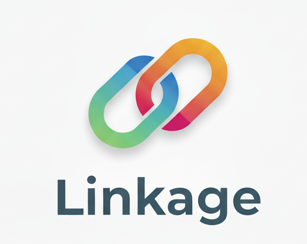

## Linkage

A self-hosted search engine that redirects to specific sites (similar to [golinks](https://meta.wikimedia.org/wiki/Go_links)).

## Features:

- Redirects to specific sites if the "search term" is available
- Redirects searches to a fallback search engine if no links are found

## Planned Features

- Appends any additionally-supplied parameters to the redirected URL
- Token-based authenticated REST API for link management and fallback search engine behavior

## Example Usage

- `gh`: redirects to https://github.com
- `gh/irlevesque`: redirects to https://github.com/irlevesque

## Setup

### Chrome (and deriviative browsers):

Go to `settings` > `search engine` and add a new "Site search" engine:
- Name: "Linkage"
- Shortcut: "go"
- URL: "http://localhost:8080/?s=%s" (assuming you're running locally on the default port).
